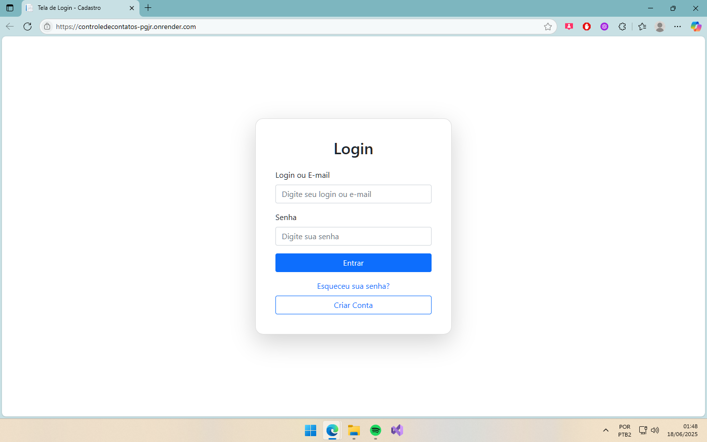
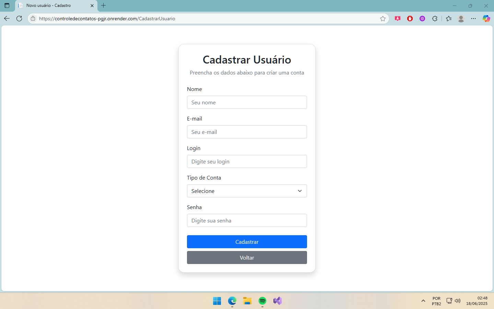
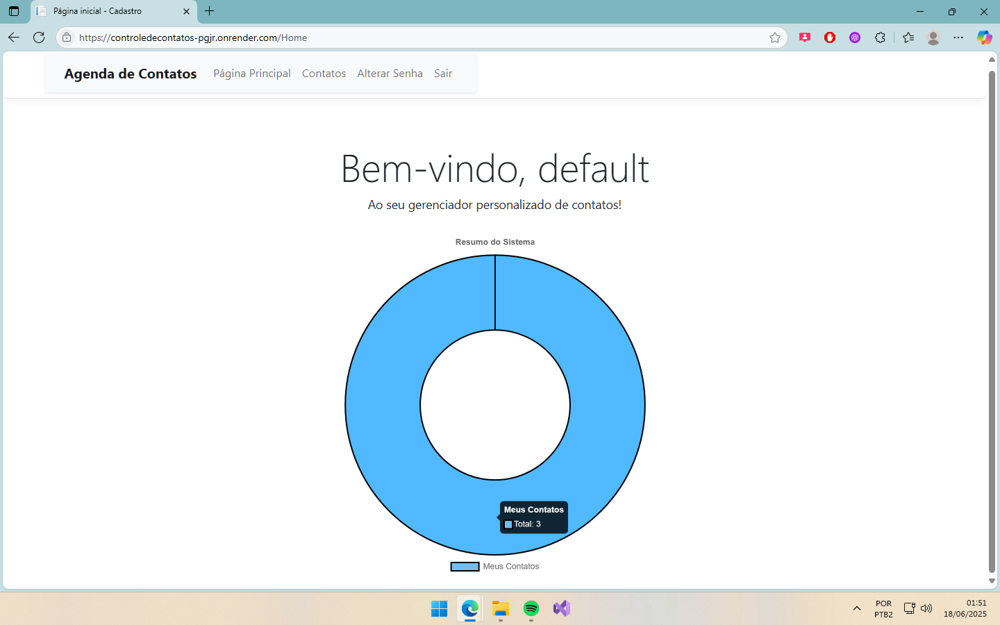
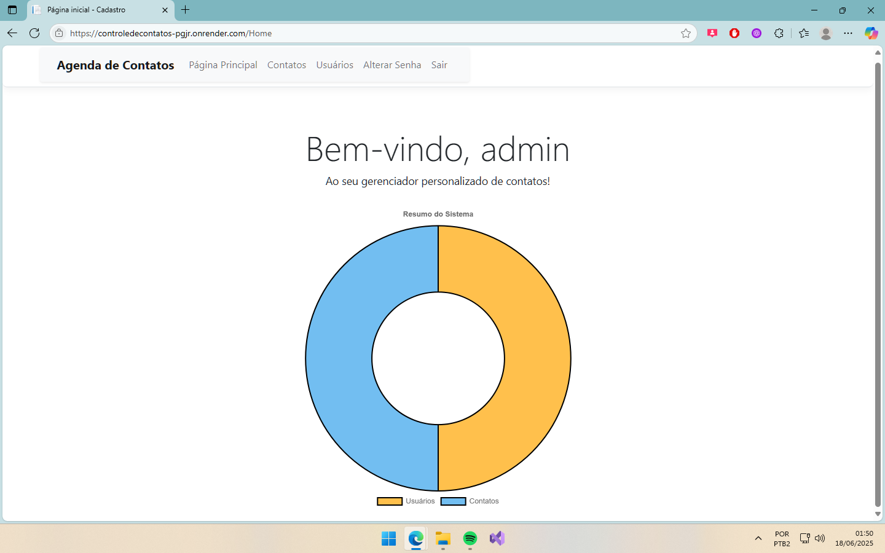
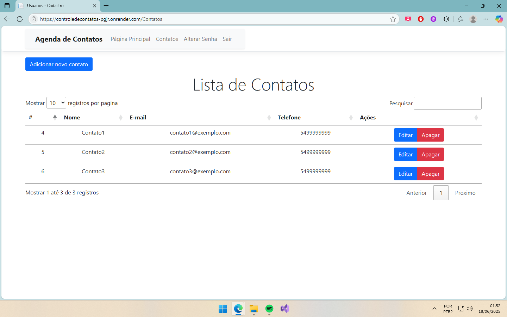
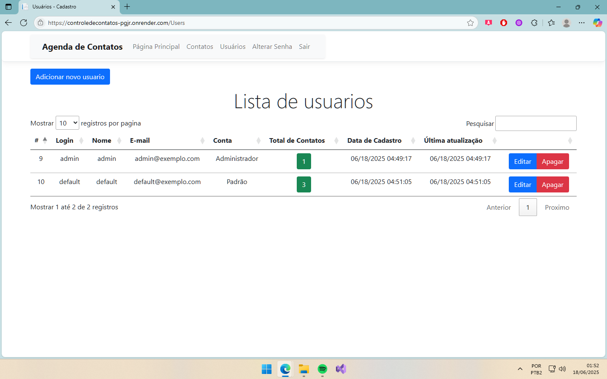
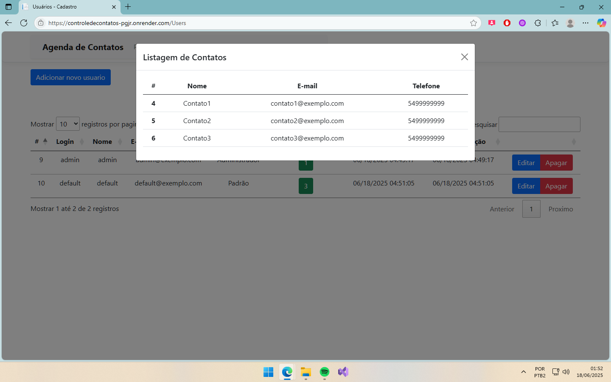

# 💼 Sistema de Controle de Contatos

## 📄 Descrição

Sistema web desenvolvido em ASP.NET MVC para gerenciamento de contatos, com funcionalidades completas de autenticação, controle de usuários e permissões. Possui diferenciação entre usuários administradores e usuários comuns, envio de e-mails para redefinição de senha, além de dashboards e recursos interativos.

O projeto foi desenvolvido com o objetivo de colocar em prática diversos conceitos fundamentais para o desenvolvimento backend e web, como:
- ✔️ Arquitetura em camadas
- ✔️ DTOs
- ✔️ Filtros de rota
- ✔️ Integração com serviços externos (e-mail)
- ✔️ Deploy de aplicações e banco em nuvem (Render + Azure SQL)
- ✔️ Dockerização da aplicação

## 🚀 Funcionalidades

- ✅ Cadastro, edição, exclusão e listagem de contatos
- ✅ Login e logout com controle de sessão
- ✅ Criptografia de Senha
- ✅ Redefinição de senha via e-mail
- ✅ Controle de acesso por tipo de usuário (Admin e Usuário Comum)
- ✅ Tabela de usuários (apenas para admins)
- ✅ Dashboard com gráficos utilizando Chart.js
- ✅ Visualização individual da quantidade de contatos de cada usuário (via AJAX no modal — apenas admins)
- ✅ Proteção de rotas utilizando filtros personalizados
- ✅ ViewComponent para menu dinâmico conforme o usuário logado
- ✅ Validações de formulário no front (HTML5 + Bootstrap) e no backend
- ✅ UI responsiva com Bootstrap e melhorias com jQuery e JavaScript

## 🧰 Tecnologias e Ferramentas

- 💻 ASP.NET MVC (.NET 8)
- 🗄️ Entity Framework
- 🗄️ SQL Azure Database
- ☁️ Render (Deploy da aplicação)
- 🐳 Docker (Containerização da aplicação)
- 🎨 Bootstrap (Interface responsiva)
- 🧠 jQuery + JavaScript (Interações e melhorias de UI)
- 📊 Chart.js (Gráficos dinâmicos no dashboard)

## 📸 Prints do sistema

### 🔑 Tela de Login

### 🔑 Cadastro de Usuário

### 🏠 Home de Usuário Default

### 🏠 Home de Usuário Admin

### 📅 Lista de Contatos

### 📅 Lista de Usuários

### 📂 Modal de Contatos

## 📝 Observações
🔸 Este projeto foi desenvolvido como iniciativa pessoal para consolidar meus conhecimentos em desenvolvimento web com ASP.NET MVC, banco de dados em nuvem e deploy de aplicações.

🔸 Estou aberto a sugestões, feedbacks e oportunidades!

## 🤝 Contato
📧 Email: bossardiluan7@gmail.com
 💼 Linkedin: https://linkedin.com/in/luan-bossardi-1b2951220/
